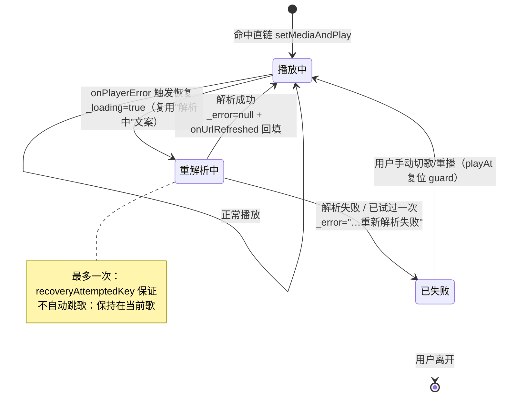
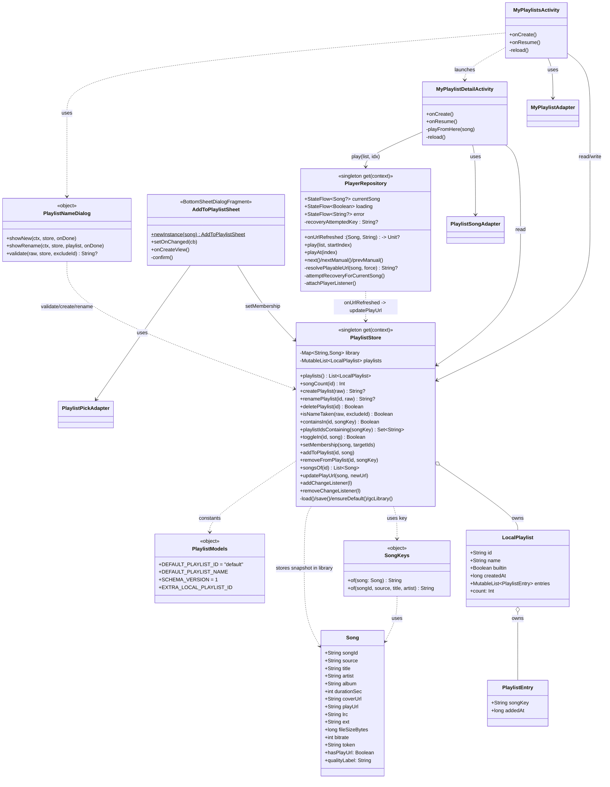

# 系统设计 + 任务分解 —— 本地歌单系统（Android 端）

> 架构师：高见远（Gao） · 团队：`software-yinfu-playlist`
> 上游输入：`docs/PRD-local-playlist.md`（产品经理 许清楚） · `docs/playlist-feature-context.md`（主理人，唯一事实来源）
> 仓库根目录：`C:\Users\b5311\WorkBuddy\2026-09-15-10-37-12\yinfu-music`
> 交付形态：**仅有设计**，本文件不含任何实现代码。工程师据第 6 节任务清单逐条施工。

---

## 0. 已核实的工程事实（**与 PRD 的差异必须先看清楚**）

架构师已逐文件核实源码，以下为**实测结论**，凡与 PRD 转述不一致者以本节为准：

| 项 | 实测结论 | 影响 |
|---|---|---|
| **ViewBinding** | `android/app/build.gradle.kts` 第 69–71 行 `buildFeatures { viewBinding = false }` | ⚠️ **PRD 第 0 节写"ViewBinding"是错误的。本项目全程 `findViewById`**，禁止使用 `ViewBinding` / `binding.xxx`，否则无法编译。 |
| compileSdk / minSdk / targetSdk | **33 / 24 / 33** | 可用 API 上限 33；`NotificationChannel` 等 API 21+ 全部可用 |
| Java / Kotlin | Java 17 / Kotlin 1.9.24 | 语言特性可放心用 |
| 可用依赖 | core-ktx 1.10.1、appcompat 1.6.1、**material 1.9.0**、constraintlayout 2.1.4、**recyclerview 1.3.2**、lifecycle-runtime-ktx 2.6.2、media3 1.0.2（exoplayer/session/ui）、okhttp 4.12.0、coroutines-android 1.8.1 | **`BottomSheetDialogFragment` 可用**（`SourceManageSheet` 已在用）；`ChipGroup` 可用；无需新增依赖 |
| `R.drawable` 现有清单（已逐个核实） | `bg_banner_badge`、`bg_gradient_accent`、`bg_mini_cover`、`bg_play_button`、`bg_quality_chip`、`bg_search_input`、`ic_close`、`ic_download`、**`ic_favorite`（实心红心，已存在）**、`ic_home`、`ic_launcher_background`、`ic_launcher_foreground`、`ic_mine`、`ic_music_note`、`ic_next`、`ic_pause`、`ic_play`、`ic_prev`、`ic_search` | **不存在** `ic_favorite_border`、`ic_add`、`ic_delete`、`ic_edit`、`ic_more` → 需新增或改用文字按钮（见 §7） |
| `R.color` 现有清单 | `bg`、`panel`、`panel_2`、`hover`、`border`、`text`、`text_2`、`text_3`、`accent_1`（#F5488B）、`accent_2`、`teal`（#2EDFA3）、`red` | 全部可复用；无需新增颜色 |
| `R.string` 现有清单 | 仅 `app_name`、`tab_*`、`search_hint`、`lyric_empty`、`download_done`、`disclaimer` | 本项目**大量中文硬编码在 Kotlin/XML 中**（如 `MineFragment`、`PlayerActivity`）。新文案沿用硬编码，**不新增 string 资源**，与既有风格一致 |
| `Song` 字段 | `songId/source/title/artist/album/durationSec/coverUrl/playUrl/lrc/ext/fileSizeBytes/bitrate/token`，全部 `var`，`Serializable` | 可直接用于 Bundle 传参；**不得改动字段语义** |
| `SongAdapter` 使用点 | **仅 2 处**：`SearchFragment.kt:59`、`PlaylistDetailActivity.kt:69`（均 `(loader, onClick, onDownload)`） | 新增参数须**放在末尾并带默认值**，两处调用零改动 |
| `NewSongAdapter` 使用点 | **仅 1 处**：`HomeFragment.kt:73`（`(loader, onClick)`） | 同上，末尾可选参数 |
| `PlayerRepository.playAt()` 直链短路 | 第 207–212 行：`if (song.hasPlayUrl) { setMediaAndPlay(song.playUrl); return }` | **"失效重解析"必须绕过此短路**（见 §3.2） |
| `PlayerRepository` 错误回调 | `attachPlayerListener()` 第 120–125 行 `onPlayerError` 只写 `_error.value`，**不自动跳歌** | 恢复逻辑的触发点，且**必须保持"不自动跳歌"** |
| `PlaylistDetailActivity` / `activity_playlist_detail.xml` | 网易云**远程**歌单详情页，**已占用** | 本地歌单**严禁复用**，新页面独立命名 |
| `mini_player` 挂载范式 | `MiniPlayerController(activity, findViewById(R.id.mini_player)).bind()`，`include` 高度须显式写 **66dp** | 新页面照抄该范式 |

---

# Part A —— 系统设计

## 1. 实现方案概述 + 框架 / 控件选型

### 1.1 核心难点

| # | 难点 | 本质 |
|---|---|---|
| D1 | 一首歌属于多张歌单，且条目要缓存"解析后的直链"、失效后要回填 | **数据布局**问题：快照放哪、回填怎么全局生效 |
| D2 | `playAt()` 命中直链即短路返回，正常路径永远不会重解析 | 需要一个**独立于正常播放路径**的"强制重解析"入口，且最多一次、不污染既有逻辑 |
| D3 | 红心状态、歌单列表、歌单详情三处 UI 要随数据变化刷新，但项目风格轻量（无 Flow/LiveData 全家桶） | **变更通知**问题 |
| D4 | 既有 `SongAdapter` 被 2 处复用，长按接入不能破坏既有调用方 | **向后兼容**问题 |
| D5 | 存储损坏、空数据、首次安装 | **健壮性**问题 |

### 1.2 选型（含"为什么不选 X"）

| 决策点 | 选型 | 理由 / 为什么不用别的 |
|---|---|---|
| 存储 | **`SharedPreferences` + `org.json`**，单文件单 key 存整份 JSON | 项目既有 `PrefsStore`、`PlayerRepository` 均用此范式；**不引入 Room**（需 KSP/注解处理器、改 `build.gradle.kts`，本机无网络下载依赖，风险极高）；数据量是"用户自建歌单"，量级极小，整份读写完全够用 |
| 页面基类 | `AppCompatActivity` + `findViewById` | **`viewBinding = false`**（已核实），全项目如此；用 Binding 会直接编译失败 |
| 返回图标 | 复用 `@drawable/ic_prev` | `activity_playlist_detail.xml` 已在用，视觉一致，零新增资产 |
| 歌单列表"重命名 / 删除"入口 | **文字按钮（`TextView`）**，不用 ImageButton | 仓库**不存在** `ic_edit` / `ic_delete`；新增 2 个图标向量是额外风险；文字按钮更直观且零新资产 |
| 「加入歌单」选择器 | **`BottomSheetDialogFragment` + `RecyclerView`(CheckBox 行)** | ① `material:1.9.0` 提供该控件，`SourceManageSheet` **已在用同款**，风险最低；② 多选列表用 `RecyclerView` 承载，比 `AlertDialog.setMultiChoiceItems` 自定义 View 更好控（滚动、复用、动态新增歌单后刷新）；③ 底部弹层符合移动端习惯。**不用 `AlertDialog` 自定义 View**——多选 + 动态增行 + 高度控制易出错 |
| 「新建 / 重命名」弹窗 | **`androidx.appcompat.app.AlertDialog` + `EditText`** | `MineFragment.showSourceStatus()` 已用 `AlertDialog.Builder` 范式；单行输入 + 两按钮，`AlertDialog` 是最简方案 |
| 事件通知 | **`onResume` 重读 + 同屏回调**（+ Store 内部 `mutableListOf<() -> Unit>` 观察者） | 见 §3.4。项目已有 `onResume` 重读范式（`MineFragment`），零新依赖 |
| 播放队列 | 从歌单点歌 → **整个歌单入队**，点击项为起点 | 主理人已裁定（Q1） |
| 歌单封面 | **统一占位** `@drawable/bg_gradient_accent` | 主理人已裁定（Q4） |

---

## 2. 文件清单

> 相对路径以仓库根 `yinfu-music/` 为基准。**"新增"= 工程师新建；"修改"= 在既有文件上追加。**

| # | 相对路径 | 动作 | 一句话职责 |
|---|---|---|---|
| 1 | `android/app/src/main/java/com/soundtrack/music/model/SongKeys.kt` | 新增 | 唯一的 songKey 生成规则（`source:songId`，兜底 `source:title#artist`） |
| 2 | `android/app/src/main/java/com/soundtrack/music/data/PlaylistModels.kt` | 新增 | 数据类 `LocalPlaylist` / `PlaylistEntry` + 常量（`DEFAULT_PLAYLIST_ID`、schema `VERSION`、Intent extra key） |
| 3 | `android/app/src/main/java/com/soundtrack/music/data/PlaylistStore.kt` | 新增 | 本地歌单仓库单例：JSON 读写、CRUD、归属查询、`updatePlayUrl` 回填、损坏降级、变更观察者 |
| 4 | `android/app/src/main/java/com/soundtrack/music/util/PlaylistNameDialog.kt` | 新增 | 新建 / 重命名歌单弹窗 + 名称校验（去空格、长度 ≤ 20、去重忽略大小写） |
| 5 | `android/app/src/main/res/drawable/ic_favorite_border.xml` | 新增 | **空心红心**（未收藏态），`ic_favorite` 实心已存在 |
| 6 | `android/app/src/main/res/drawable/ic_add.xml` | 新增 | "新建歌单" 加号图标（S3 顶栏） |
| 7 | `android/app/src/main/AndroidManifest.xml` | 修改 | 注册 `MyPlaylistsActivity`、`MyPlaylistDetailActivity`（`exported=false`，`portrait`） |
| 8 | `android/app/src/main/java/com/soundtrack/music/player/PlayerRepository.kt` | 修改 | 加 `force` 参数、`onUrlRefreshed` 回调、`attemptRecoveryForCurrentSong()` 恢复入口，接入 `onPlayerError` |
| 9 | `android/app/src/main/java/com/soundtrack/music/SoundtrackApp.kt` | 修改 | 初始化 `PlaylistStore` 并挂接"回填直链"回调（一次性） |
| 10 | `android/app/src/main/java/com/soundtrack/music/ui/MyPlaylistDetailActivity.kt` | 新增 | **S4 歌单详情页**（返回 + 名 + 数 + 歌曲列表 + 空态 + 迷你条） |
| 11 | `android/app/src/main/res/layout/activity_my_playlist_detail.xml` | 新增 | S4 布局 |
| 12 | `android/app/src/main/res/layout/item_playlist_song.xml` | 新增 | S4 条目（含**解析后播放地址**行） |
| 13 | `android/app/src/main/java/com/soundtrack/music/adapter/PlaylistSongAdapter.kt` | 新增 | S4 条目适配器（展示 5 项信息 + 长按复制地址 / 长按移除） |
| 14 | `android/app/src/main/java/com/soundtrack/music/ui/MyPlaylistsActivity.kt` | 新增 | **S3 我的歌单列表页**（默认置顶 + 自建 + 新建/重命名/删除） |
| 15 | `android/app/src/main/res/layout/activity_my_playlists.xml` | 新增 | S3 布局 |
| 16 | `android/app/src/main/res/layout/item_my_playlist.xml` | 新增 | S3 条目 |
| 17 | `android/app/src/main/java/com/soundtrack/music/adapter/MyPlaylistAdapter.kt` | 新增 | S3 条目适配器 |
| 18 | `android/app/src/main/res/layout/dialog_playlist_name.xml` | 新增 | S6 输入框布局 |
| 19 | `android/app/src/main/java/com/soundtrack/music/ui/MineFragment.kt` | 修改 | 「我的」页接歌单入口：点击 `btn_my_playlists` 启动 S3；`onResume` 刷新摘要 |
| 20 | `android/app/src/main/res/layout/fragment_mine.xml` | 修改 | 在 `btn_source_status` 与「本地下载」之间插入"我的歌单"区块 |
| 21 | `android/app/src/main/java/com/soundtrack/music/ui/AddToPlaylistSheet.kt` | 新增 | **S5 加入歌单选择器**（`BottomSheetDialogFragment`） |
| 22 | `android/app/src/main/res/layout/sheet_add_to_playlist.xml` | 新增 | S5 布局 |
| 23 | `android/app/src/main/res/layout/item_pick_playlist.xml` | 新增 | S5 复选行 |
| 24 | `android/app/src/main/java/com/soundtrack/music/adapter/PlaylistPickAdapter.kt` | 新增 | S5 复选适配器 |
| 25 | `android/app/src/main/java/com/soundtrack/music/ui/PlayerActivity.kt` | 修改 | 补 `btn_favorite` 点击（收藏/取消）+ 状态同步；长按红心打开 S5；`onResume` 刷新 |
| 26 | `android/app/src/main/java/com/soundtrack/music/adapter/SongAdapter.kt` | 修改 | 末尾新增可选 `onLongClick`，`item_song` 长按回调 |
| 27 | `android/app/src/main/java/com/soundtrack/music/adapter/NewSongAdapter.kt` | 修改 | 末尾新增可选 `onLongClick`（首页长按） |
| 28 | `android/app/src/main/java/com/soundtrack/music/ui/SearchFragment.kt` | 修改 | 传 `onLongClick` → 打开 S5 |
| 29 | `android/app/src/main/java/com/soundtrack/music/ui/HomeFragment.kt` | 修改 | 传 `onLongClick` → 打开 S5 |
| 30 | `CHANGELOG.md`（仓库根） | 修改 | 追加一条变更记录（工程师阶段） |

**统计**：新增 **19** 个文件 = Kotlin 源码 **10** 个（`PlaylistStore` / `PlaylistModels` / `SongKeys` / `PlaylistNameDialog` / 2 个 Activity / 1 个 BottomSheet / 3 个 Adapter）+ 布局 **7** 个 + drawable **2** 个；修改 **11** 个既有文件（`AndroidManifest.xml`、`PlayerRepository.kt`、`SoundtrackApp.kt`、`PlayerActivity.kt`、`MineFragment.kt`、`fragment_mine.xml`、`SongAdapter.kt`、`NewSongAdapter.kt`、`SearchFragment.kt`、`HomeFragment.kt`、`CHANGELOG.md`）。合计 **30** 个文件涉及；**不含任何第三方依赖文件**。

---

## 3. 数据结构与接口

### 3.1 数据布局决策：**全局曲库 + 歌单持有序 songKey 列表**（关键决策）

**结论**：采用
> **全局曲库 `songKey → Song 快照`** ＋ **每张歌单持有有序 `songKey` 列表（含加入时间）**。

**取舍论证（对比"每歌单各自持完整 Song 快照"）**：

| 维度 | 全局曲库（**采纳**） | 每歌单独立快照（放弃） |
|---|---|---|
| **回填直链** | ✅ **一次写入，全部歌单同时生效**（回填只需更新曲库里那一条） | ❌ 同一首歌若在 3 张歌单，需逐歌单定位并更新 3 份，且**无法保证一致**（只更新了当前播放的那份，其它仍是死链） |
| 存储冗余 | ✅ 每首唯一歌只存一份元数据；歌单只存短 `songKey` | ❌ 同一首歌在多张歌单里存多份完整 JSON，冗余且易漂移 |
| 去重 | ✅ **天然去重**：`songKey` 在歌单列表里出现一次即唯一（AC-21 直接满足） | ❌ 每份独立，需额外编写去重逻辑 |
| 元数据富化一致性 | ✅ 解析命中 fallback 时对 `playUrl/ext/durationSec/coverUrl` 的富化"一处更新，处处可见" | ❌ 富化只落到某一副本 |
| 删除歌单清理 | ⚠️ 需一次 GC：删除后扫描"不再被任何歌单引用的 songKey"并从曲库剔除 | ✅ 无残留（但代价是上面的不一致） |

**清理策略**：`deletePlaylist(id)` 后执行 `gcLibrary()` —— 遍历曲库，剔除"不再被任何歌单引用"的 `songKey`。歌单数量与曲库规模均为用户自建量级（几十~几百），O(n) 全量 GC 完全可接受。**默认歌单不可删，因此被它引用的歌永远留着**。

**顺序与时间**：每张歌单存 `entries: List<PlaylistEntry>`，`PlaylistEntry(songKey, addedAt)`。数组顺序即"加入顺序"；`addedAt` 供 P2-1 时间排序备用。**展示方向**：本设计默认"加入时间倒序"（PRD 未强制，P2-1 才要求可切换；列表按 `addedAt` 倒序排列，天然满足"新加入的在上"）。

### 3.2 直链失效自动重解析回填 —— 接入方案（关键决策）

**问题**：`playAt()` 第 207–212 行是短路 `if (song.hasPlayUrl) { setMediaAndPlay(...); return }`，直链非空（失效的也是 `http` 开头）时**永远不会进入 `resolvePlayableUrl`**。因此恢复**不能走 `playAt`**。

**方案**：新增**独立恢复入口** `attemptRecoveryForCurrentSong()`，仅由 `onPlayerError` 触发；给 `resolvePlayableUrl` 增加 `force` 参数；重解析结果通过 `onUrlRefreshed` 回调**回填到 `PlaylistStore`**（跨进程持久化）。

**新增/修改的签名**：

```kotlin
// —— PlayerRepository.kt（private constructor 单例，既有） ——

/** 播放地址被重新解析成功时回调（第 1 参=歌曲，第 2 参=新地址）。
 *  由 SoundtrackApp 一次性挂接为 PlaylistStore.updatePlayUrl，实现"回填歌单条目"。
 *  默认 null：不挂接时行为与旧版完全一致（零副作用）。 */
var onUrlRefreshed: ((Song, String) -> Unit)? = null

/** 解析可播放地址。[force]=true 时忽略任何已缓存地址，强制走一次完整解析。
 *  既有调用点（playAt 的非缓存分支）不传 force，行为不变。 */
private suspend fun resolvePlayableUrl(song: Song, force: Boolean = false): String?

/** 直链失效后的恢复入口：强制重解析一次 → 成功则回填 + 继续播放；失败则仅提示、不跳歌。
 *  仅允许每个"播放尝试"重解析一次（见 recoveryAttemptedKey 防风暴）。 */
private fun attemptRecoveryForCurrentSong()

/** 本"播放尝试"是否已重解析过（防重解析风暴）。playAt() 开头复位。 */
private var recoveryAttemptedKey: String? = null

// onPlayerError 内追加（在既有三行赋值之后）：
//   mainHandler.post { attemptRecoveryForCurrentSong() }
```

**`resolvePlayableUrl` 的 `force` 具体作用**（让参数有实际语义、而非摆设）：

```kotlin
private suspend fun resolvePlayableUrl(song: Song, force: Boolean = false): String? {
    // 非强制时，若已有直链直接复用（该分支在既有 playAt 路径下恒不命中，
    // 因为 playAt 已经在更外层短路；新增它是为了让 force 有明确语义、且为将来留口）
    if (!force && song.hasPlayUrl) return song.playUrl
    ... // 其余逻辑完全不动
}
```

**恢复方法体（设计级伪代码，非实现）**：

```
attemptRecoveryForCurrentSong():
    song = _currentSong.value ?: return
    idx  = currentIndex;  if idx 不在 _queue.indices: return
    key  = SongKeys.of(song)
    if recoveryAttemptedKey == key: return          // ← 防重解析风暴：本尝试已试过，直接放弃
    recoveryAttemptedKey = key
    _error.value = null
    _loading.value = true                            // ← UI 呈现"重解析中"（复用现有"解析中"通道）
    resolveJob?.cancel(); resolveJob = null
    val token = ++resolveToken
    resolveJob = scope.launch(Dispatchers.IO):
        url = runCatching { resolvePlayableUrl(song, force = true) }.getOrNull()
        withContext(Dispatchers.Main):
            if token != resolveToken || currentIndex != idx: return   // 已被新请求取代
            _loading.value = false
            if (!url.isNullOrBlank() && url.startsWith("http")):
                onUrlRefreshed?.invoke(song, url)        // ← 1) 回填歌单条目（持久化）
                setMediaAndPlay(url)                     // ← 2) 用新地址继续播放
                failedInThisRound.clear()
            else:
                _error.value = "《${song.title}》播放地址已失效，重新解析失败"
                // ← 3) 不自动跳歌（与既有原则一致）
```

**`playAt()` 需追加一行**：在方法开头（`resolveJob?.cancel()` 附近）加入 `recoveryAttemptedKey = null`，语义为"每次用户主动点播/切歌是一次新的播放尝试，允许它重新解析一次"。这样：用户再点一次同一首（此时 `playUrl` 仍是死的）→ 短路播放 → 再次失败 → 再次恢复 → 成功，**不会出现"点第二次就再也不恢复"**。

**状态机**（用户可见的三态）：



**为什么"不污染既有播放逻辑"**：
1. `onUrlRefreshed` 默认 `null`，未挂接时恢复路径退化为"仅多一次解析尝试"，行为与旧版一致；
2. `onPlayerError` 的既有语义（不自动跳歌）完整保留——恢复失败时同样不跳歌；
3. 恢复走的是**独立协程 + 独立 token 校验**，复用 `resolveToken` 使它与正常切歌互斥，不会并发覆盖；
4. 恢复不修改 `failedInThisRound / playedInThisRound` 的既有语义（成功时 `failedInThisRound.clear()`，失败时不动）。

### 3.3 红心状态同步（接入点）

- **数据来源**：`PlayerActivity` 既有 `repo.currentSong.onEach { ... }`（第 110–167 行）已经是"随当前歌实时刷新"的链路，**红心刷新直接挂进这个 collector 末尾**（或在其中调用 `refreshFavorite(song)`）。
- **点击**：`btn_favorite.setOnClickListener { toggleFavorite() }`。
- **长按**：`btn_favorite.setOnLongClickListener { AddToPlaylistSheet.newInstance(song).show(supportFragmentManager, TAG); true }`（Q3 已裁定：长按触发，**不新增常驻按钮、不动 `btn_favorite` 位置**）。
- **`onResume`**：从选择器返回后再刷一次（`refreshFavorite(repo.currentSong.value)`），保证 UI 与存储一致。
- `refreshFavorite(song)`：`song==null` → 空心 + `alpha=0.4f` + `isEnabled=false`；否则按 `PlaylistStore.get(this).containsIn(DEFAULT_PLAYLIST_ID, SongKeys.of(song))` 切换 `ic_favorite` / `ic_favorite_border`。
- `toggleFavorite()`：读 `currentSong`（null 直接 return，满足 5.11）→ `store.toggleIn(DEFAULT_PLAYLIST_ID, song)` → `refreshFavorite(song)` → Toast（"已加入我喜欢的音乐" / "已从我喜欢的音乐移除"）。

### 3.4 UI 变更通知（轻量方案）

**方案：`onResume` 重读为主 + 同屏回调为辅 + Store 内部观察者（可选）**。

- 已打开的**列表页 / 详情页**：在 `onResume()` 重新从 `PlaylistStore` 读取并 `notifyDataSetChanged()`。因为歌单数据变化**只会由用户操作触发**（点红心、选择器确认、增删改歌单），而每次操作必然发生在某个页面前台；当用户从操作页返回列表/详情页时，`onResume` 一定先于可见执行 → 数据必然最新。
- **同屏**（在详情页内长按移除、在列表页内增删改名）：操作完成后**直接调用本页的 `reload()`**，无需等 onResume。
- **选择器跨页**：`AddToPlaylistSheet.setOnChanged { ... }` 回调（照抄 `SourceManageSheet.setOnChanged` 范式），打开它的页面在其中刷新红心/列表。
- **为什么够用、不引入 Flow/LiveData**：数据规模小（用户自建歌单）、变更频率极低（人工点击）、无并发写入、无跨进程即时性要求；`onResume` 重读是项目**既有范式**（`MineFragment.onResume` 刷新下载列表 + 音源文案）。引入 Flow 全家桶会带来 `lifecycle-runtime-ktx` 之外的架构负担与学习/出错成本，收益近乎为零。

### 3.5 存储 schema（带 `version`，损坏降级）

**`SharedPreferences` 文件名**：`local_playlists`（`Context.MODE_PRIVATE`）
**key**：`data`（单个 JSON 字符串）

```jsonc
{
  "version": 1,                       // schema 版本；解析到未知高版本 → 亦降级
  "playlists": [                      // 顺序 = 展示顺序；默认歌单恒为首项
    {
      "id": "default",                // 默认歌单 id 常量 = "default"
      "name": "我喜欢的音乐",
      "builtin": true,                // true = 不可删不可改名
      "createdAt": 0,
      "entries": [                    // 有序；元素=引用全局曲库
        { "key": "migu:123456", "addedAt": 1726400000000 }
      ]
    }
  ],
  "songs": {                          // 全局曲库：songKey -> 歌曲快照
    "migu:123456": {
      "songId": "123456", "source": "migu", "title": "歌名", "artist": "歌手",
      "album": "", "durationSec": 245, "coverUrl": "https://...",
      "playUrl": "https://.../a.mp3", "lrc": "", "ext": "mp3",
      "fileSizeBytes": 0, "bitrate": 320, "token": ""
    }
  }
}
```

**健壮性规则**：
- 读取时 `try/catch(Throwable)` 包裹；**任何异常 / `version` 高于支持值 / 结构非法** → 降级为"仅默认歌单 + 空曲库"，**静默**（不崩溃、不弹窗），满足 5.10 / AC-33；
- `version` 字段为未来迁移预留：`when(version) { 1 -> ...; else -> 降级 }`；
- 写入用 `prefs.edit().putString(...).apply()`（与既有范式一致）；
- 首次读取若文件不存在 → 自动创建默认歌单并落盘（满足 5.9）。

### 3.6 `PlaylistStore` 对外接口（完整签名）

```kotlin
package com.soundtrack.music.data

class PlaylistStore private constructor(context: Context) {

    companion object {
        @Volatile private var instance: PlaylistStore? = null
        fun get(context: Context): PlaylistStore = instance ?: synchronized(this) {
            instance ?: PlaylistStore(context.applicationContext).also { instance = it }
        }
        /** 达到用「新建时」的候选歌单数上限（防止极端灌数据），可设为 100 */
        const val MAX_PLAYLISTS = 100
    }

    /** 所有歌单（默认歌单恒为首项）。返回副本，外部不可改内部状态。 */
    fun playlists(): List<LocalPlaylist>

    /** 歌单名 -> 歌曲数（供「我的」页 / 列表页摘要） */
    fun songCount(playlistId: String): Int

    // —— 歌单 CRUD ——
    /** 校验由 PlaylistNameDialog 负责；返回 null=成功，否则返回错误文案。 */
    fun createPlaylist(rawName: String): String?
    fun renamePlaylist(playlistId: String, rawName: String): String?
    fun deletePlaylist(playlistId: String): Boolean      // 默认歌单不可删 → false

    /** 名称是否已被占用（去首尾空格、忽略大小写）；默认歌单名「我喜欢的音乐」亦算占用。 */
    fun isNameTaken(rawName: String, excludeId: String? = null): Boolean

    // —— 归属查询 / 变更 ——
    fun containsIn(playlistId: String, songKey: String): Boolean
    fun playlistIdsContaining(songKey: String): Set<String>
    /** 红心开关：在默认歌单中增/删（默认歌单内置 toggle 便捷法） */
    fun toggleIn(playlistId: String, song: Song): Boolean   // 返回 true=加入后存在
    /** 选择器确认：把 song 的归属一次性置为目标集合（差量增删），持久化一次。 */
    fun setMembership(song: Song, targetPlaylistIds: Set<String>)
    fun addToPlaylist(playlistId: String, song: Song)
    fun removeFromPlaylist(playlistId: String, songKey: String)

    /** 歌单内的歌曲列表（按 entries 顺序）。未命中曲库的 songKey 静默跳过。 */
    fun songsOf(playlistId: String): List<Song>

    /** 直链回填：由 PlayerRepository.onUrlRefreshed 调用。写入全局曲库 → 全歌单生效。 */
    fun updatePlayUrl(song: Song, newUrl: String)

    // —— 变更通知（轻量，可选）——
    fun addChangeListener(l: () -> Unit)
    fun removeChangeListener(l: () -> Unit)

    // 内部：load()/save()/ensureDefault()/gcLibrary()/toJson()/fromJson()
}
```

### 3.7 数据类与常量

```kotlin
package com.soundtrack.music.data

/** 歌单条目：只持有"引用 + 加入时间"，歌曲元数据在全局曲库 */
data class PlaylistEntry(val songKey: String, val addedAt: Long)

/** 一张本地歌单 */
data class LocalPlaylist(
    val id: String,
    var name: String,
    val builtin: Boolean,
    val createdAt: Long,
    val entries: MutableList<PlaylistEntry>
) {
    val count: Int get() = entries.size
}

object PlaylistModels {
    const val DEFAULT_PLAYLIST_ID = "default"
    const val DEFAULT_PLAYLIST_NAME = "我喜欢的音乐"
    const val SCHEMA_VERSION = 1
    const val MAX_NAME_LEN = 20
    /** S3/S4 之间传参用的 extra key（**故意与远程歌单的 "playlist_id" 区分开**） */
    const val EXTRA_LOCAL_PLAYLIST_ID = "local_playlist_id"
    const val EXTRA_LOCAL_PLAYLIST_NAME = "local_playlist_name"
}
```

```kotlin
package com.soundtrack.music.model

/** songKey 唯一规则：一首歌在全局曲库/出队去重中的身份。 */
object SongKeys {
    /** 优先 source:songId；songId 为空时退化为 source:title#artist。 */
    fun of(song: Song): String {
        val id = song.songId.trim()
        return if (id.isNotEmpty()) "${song.source}:$id"
        else "${song.source}:${song.title.trim()}#${song.artist.trim()}"
    }
    fun of(songId: String, source: String, title: String = "", artist: String = ""): String =
        if (songId.trim().isNotEmpty()) "$source:${songId.trim()}"
        else "$source:${title.trim()}#${artist.trim()}"
}
```

### 3.8 Mermaid classDiagram



---

## 4. 程序调用流程

### (a) 播放页点红心：收藏 / 取消（US1 / US2 / P0-2）

```mermaid
sequenceDiagram
    autonumber
    actor U as 用户
    participant PA as PlayerActivity
    participant PS as PlaylistStore
    participant P as SharedPreferences(local_playlists)

    U->>PA: 点击 btn_favorite
    PA->>PA: song = repo.currentSong.value
    alt song == null
        PA-->>U: 不写入（可选 Toast「当前没有在播放的歌曲」）
    else
        PA->>PS: toggleIn(DEFAULT_PLAYLIST_ID, song)
        PS->>PS: key = SongKeys.of(song)
        alt 默认歌单已含 key
            PS->>PS: entries.remove(key); gcLibrary()
        else 不含
            PS->>PS: library[key] = song 快照；entries.add(PlaylistEntry(key, now))
        end
        PS->>P: save()（整份 JSON，version=1）
        PS-->>PA: 返回 boolean(是否已收藏)
        PA->>PA: refreshFavorite(song) 切 ic_favorite / ic_favorite_border
        PA-->>U: Toast「已加入我喜欢的音乐」/「已从我喜欢的音乐移除」
    end
    Note over PA: 切歌时：repo.currentSong.onEach 已挂 refreshFavorite(song)，<br/>红心随当前歌实时刷新（AC-6）
```

### (b) 从歌单点歌命中缓存直链（零解析，US8 / P0-13）

```mermaid
sequenceDiagram
    autonumber
    actor U as 用户
    participant MD as MyPlaylistDetailActivity
    participant PS as PlaylistStore
    participant PR as PlayerRepository
    participant EX as ExoPlayer

    U->>MD: 点击歌单内某条（该条 playUrl 已缓存）
    MD->>PS: songsOf(playlistId)
    PS-->>MD: List<Song>（顺序=歌单顺序；Song.playUrl 已非空）
    MD->>PR: play(list, index=点击下标)
    PR->>PR: _queue=list; currentIndex=index; startService()
    PR->>PR: playAt(index)
    PR->>PR: recoveryAttemptedKey = null
    PR->>PR: song.hasPlayUrl == true ✅（http 开头）
    Note over PR,EX: 关键：直接 setMediaAndPlay(song.playUrl)<br/>**不调用 resolvePlayableUrl，零音源解析**（AC-27）
    PR->>EX: stop()/clearMediaItems()/setMediaItem(url)/prepare()/play()
    PR-->>MD: loading=false（UI 无"解析中"）
    MD->>MD: startActivity(PlayerActivity)
```

### (c) 直链失效 → 重解析 → 回填 → 继续播放（US9 / P0-14）

```mermaid
sequenceDiagram
    autonumber
    participant EX as ExoPlayer
    participant PR as PlayerRepository
    participant MH as mainHandler(Main)
    participant IO as 解析协程(IO)
    participant SR as SourceResolver
    participant PS as PlaylistStore
    actor U as 用户

    Note over PR: 当前歌由"直链短路"启动，playUrl 已失效
    EX->>PR: onPlayerError(PlaybackException)
    PR->>PR: _isPlaying=false; _loading=false; _error="播放失败: ..."
    PR->>MH: post { attemptRecoveryForCurrentSong() }
    Note over PR,MH: 切出回调栈再执行，避免 ExoPlayer 重入
    MH->>PR: attemptRecoveryForCurrentSong()
    PR->>PR: song=currentSong; key=SongKeys.of(song)
    alt recoveryAttemptedKey == key（本尝试已试过）
        PR-->>U: 仅保留失败提示，不重解析、不跳歌
    else 首次
        PR->>PR: recoveryAttemptedKey = key
        PR->>PR: _error=null; _loading=true（UI=「重解析中」）
        PR->>IO: launch { resolvePlayableUrl(song, force=true) }
        IO->>SR: resolve(source).resolvePlayUrl(song)（含 fallback 补搜）
        SR-->>IO: newUrl 或 null
        IO->>PR: withContext(Main) 回主线程（校验 token/currentIndex）
        alt newUrl 有效
            PR->>PS: onUrlRefreshed(song, newUrl)
            PS->>PS: library[key].playUrl = newUrl; save()（跨进程持久化，AC-30）
            PR->>EX: setMediaAndPlay(newUrl) → 继续播放
            PR-->>U: 无感恢复（loading=false，无"解析中"）
        else 仍失败
            PR->>PR: _error="《歌名》播放地址已失效，重新解析失败"
            PR-->>U: Toast 提示，**不自动跳歌**（AC-31）
        end
    end
    Note over PS: 详情页 onResume / 同屏 reload() 会把条目地址行刷成新地址
```

---

## 5. 任务列表（有序，含依赖）

> **依赖链尽量收敛到 T01 根部**；建议实现顺序：T01 → T02 → T03 → T04 → T05。

### T01 —— 基础层：数据模型 + 本地歌单仓库 + 名称弹窗 + 图标资产 + 清单
**优先级**：P0 ｜ **依赖**：无
**产出文件**：
- 新增 `model/SongKeys.kt`（§3.7）
- 新增 `data/PlaylistModels.kt`（`PlaylistEntry` / `LocalPlaylist` / 常量，§3.7）
- 新增 `data/PlaylistStore.kt`（§3.6，含 schema v1、损坏降级、`gcLibrary`）
- 新增 `util/PlaylistNameDialog.kt`（新建/重命名弹窗 + `validate()` 校验逻辑，§3.7）
- 新增 `res/layout/dialog_playlist_name.xml`（单个 `EditText id=input_name`，`maxLength=20`、单行）
- 新增 `res/drawable/ic_favorite_border.xml`（**空心红心**；官方 Material `favorite_border` 路径）
- 新增 `res/drawable/ic_add.xml`（**加号**；官方 Material `add` 路径）
- 修改 `AndroidManifest.xml`：注册 `.ui.MyPlaylistsActivity`、`.ui.MyPlaylistDetailActivity`（`exported=false`、`screenOrientation="portrait"`；**不加 launchMode**）

**验收要点**：`PlaylistStore.get(ctx)` 单例；`ensureDefault()` 首次自动建默认歌单；损坏 JSON → 仅默认歌单不崩溃；`createPlaylist` 同名/空名/超长/保留名返回对应错误文案。

---

### T02 —— 播放内核：直链失效的强制重解析与回填挂接
**优先级**：P0 ｜ **依赖**：T01
**产出文件**：
- 修改 `player/PlayerRepository.kt`：
  1. 新增属性 `var onUrlRefreshed: ((Song, String) -> Unit)? = null`
  2. `resolvePlayableUrl` 签名加 `force: Boolean = false`，并在开头加 `if (!force && song.hasPlayUrl) return song.playUrl`（§3.2）
  3. 新增 `private var recoveryAttemptedKey: String? = null`
  4. 新增 `private fun attemptRecoveryForCurrentSong()`（§3.2 伪代码），内部用 `mainHandler`/`resolveToken`/`scope`，**注意所有 player 操作必须在主线程且不在回调栈内**
  5. `playAt()` 开头（`currentIndex = index` 附近）追加 `recoveryAttemptedKey = null`
  6. `onPlayerError` 末尾追加 `mainHandler.post { attemptRecoveryForCurrentSong() }`；**保留既有三行与"不自动跳歌"注释语义**
- 修改 `SoundtrackApp.kt`：`onCreate()` 中 `PlayerRepository.get(this).onUrlRefreshed = { song, url -> PlaylistStore.get(this).updatePlayUrl(song, url) }`（放在 `SourceResolver.init(this)` 之后即可）

**验收要点**：AC-27/28/29/30/31；正常路径零副作用（`onUrlRefreshed` 未挂接时行为与旧版一致）。

---

### T03 —— 歌单详情页（S4）
**优先级**：P0 ｜ **依赖**：T01、T02
**产出文件**：
- 新增 `ui/MyPlaylistDetailActivity.kt`：
  - 读 extra `EXTRA_LOCAL_PLAYLIST_ID`；`PlaylistStore.get(this).songsOf(id)`；顶部 `btn_back` → `finish()`；`detail_title` = 歌单名、`detail_count` = 「N 首」
  - 空态：默认歌单 → 「还没有喜欢的歌曲，去播放页点小红心收藏吧」；自建 → 「这个歌单还没有歌曲」；有歌则 `empty_hint` 隐藏
  - `MiniPlayerController(this, findViewById(R.id.mini_player)).bind()`（**必须在提前 return 之前**，参照 `PlaylistDetailActivity`）
  - 点击条目 → `PlayerRepository.get(this).play(songs, idx)` + 跳 `PlayerActivity`（Q1：整歌单入队）
  - 长按地址行 → 复制完整 `playUrl` 到剪贴板 + Toast「已复制播放地址」（P1-3）；地址为空/非 http 时提示无效
  - 长按条目 → 弹「从本歌单移除」（Q2；默认歌单也允许移除）+ 确认 → `store.removeFromPlaylist` → `reload()`
  - `onResume()` → `reload()`（回填后地址行刷新）；`store.addChangeListener` 可选
- 新增 `res/layout/activity_my_playlist_detail.xml`（顶栏 `btn_back` + `detail_title` + `detail_count`；`recycler_playlist_songs`；`empty_hint`；`include id=mini_player height=66dp`）
- 新增 `res/layout/item_playlist_song.xml`（`cover` / `title` / `duration` / `artist` / `source` / **`play_url`** / `btn_item_more`；地址行 `maxLines=1` `ellipsize="middle"`）
- 新增 `adapter/PlaylistSongAdapter.kt`（**不使用 `item_song`**）：绑定 5 项信息；音源中文名用 `BuiltinSources.BY_ID[s.source]?.label ?: DIRECT_LABEL ?: s.source`（复用 `SongAdapter` 现有映射逻辑）；`play_url` 为空/非 http → 占位「未解析 · 播放时自动解析」；暴露 `onClick` / `onLongClickItem` / `onLongClickUrl`

**验收要点**：AC-22 ~ AC-26；AC-27/28/29/30（在详情页路径下）；不触碰 `ui/PlaylistDetailActivity.kt` / `activity_playlist_detail.xml`。

---

### T04 —— 我的歌单列表页（S3）+「我的」页入口（S2）
**优先级**：P0 ｜ **依赖**：T01、T03
**产出文件**：
- 新增 `ui/MyPlaylistsActivity.kt`：
  - 顶栏 `btn_back` → `finish()`；`btn_new_playlist` → `PlaylistNameDialog.showNew(this, store) { reload() }`
  - 列表：默认歌单恒置顶（`builtin=true` 行隐藏重命名/删除入口，`visibility=GONE`）；自建按 `createdAt` 倒序
  - 点击行 → `startActivity(MyPlaylistDetailActivity, EXTRA_LOCAL_PLAYLIST_ID=id, EXTRA_LOCAL_PLAYLIST_NAME=name)`
  - 重命名 → `PlaylistNameDialog.showRename(...)`；删除 → `AlertDialog` 二次确认 → `store.deletePlaylist(id)` → `reload()`
  - `onResume()` → `reload()`（从详情页返回刷新歌数）
- 新增 `res/layout/activity_my_playlists.xml`（顶栏 `btn_back` + `page_title` + `btn_new_playlist`(`ic_add`)；`recycler_playlists`；`include id=mini_player height=66dp`）
- 新增 `res/layout/item_my_playlist.xml`（`cover`(@drawable/bg_gradient_accent) / `name` / `count` / **文字按钮 `btn_rename`、`btn_delete`**）
- 新增 `adapter/MyPlaylistAdapter.kt`（默认行隐藏改名/删除；暴露 `onClick` / `onRename` / `onDelete`）
- 修改 `ui/MineFragment.kt`：`btn_my_playlists` 点击 → 启动 S3；`onResume()` 刷新摘要文案「共 N 张歌单 · 我喜欢的音乐 M 首」
- 修改 `res/layout/fragment_mine.xml`：在 `btn_source_status` 与「本地下载」之间插入「我的歌单」小标题 + 可点击行 `btn_my_playlists`（`LinearLayout`，`background=?attr/selectableItemBackground`，内含 `TextView`），**不删改任何既有控件**

**验收要点**：AC-1、AC-2、AC-8 ~ AC-14；防同名/防改名默认歌单在 `PlaylistStore` 与 UI 双层拦截（5.1）。

---

### T05 —— 红心收藏 + 加入歌单选择器 + 搜索/首页长按接入
**优先级**：P0（红心、P0-11）/ P1（长按红心加其他歌单）
**依赖**：T01、T02
**产出文件**：
- 新增 `ui/AddToPlaylistSheet.kt`（`BottomSheetDialogFragment`）：
  - `newInstance(song)` 用 `Bundle` 传 `Song`（`Song : Serializable`）
  - 列出全部歌单（**含默认歌单**），已包含该歌的显示已勾选（`store.playlistIdsContaining(key)`，AC-16）
  - `btn_new_in_picker` → `PlaylistNameDialog.showNew(...)` → 成功后把新歌单**自动勾选**（AC-19）
  - `btn_confirm` → `store.setMembership(song, 勾选集合)`（一次写入，AC-17/18）→ `setOnChanged?.invoke()` → dismiss
  - `btn_cancel` / 点外部 → 不写入（AC-20）；`setOnChanged(cb)` 范式照抄 `SourceManageSheet`
- 新增 `res/layout/sheet_add_to_playlist.xml`（`picker_title` / `song_label` / `recycler_pick_list`(maxHeight≈320dp) / `btn_new_in_picker` / `btn_confirm` / `btn_cancel`）
- 新增 `res/layout/item_pick_playlist.xml`（`check`(CheckBox, `buttonTint=@color/teal`) / `name`）
- 新增 `adapter/PlaylistPickAdapter.kt`（勾选状态本地维护，`checkedIds()`；行点击切换勾选）
- 修改 `ui/PlayerActivity.kt`：
  - `onCreate`：`val btnFavorite = findViewById<ImageButton>(R.id.btn_favorite)`；点击 → `toggleFavorite()`；长按 → 打开 S5（`supportFragmentManager`）
  - 在既有 `repo.currentSong.onEach { song -> ... }` 末尾追加 `refreshFavorite(song)`（§3.3）
  - `onResume()` 追加 `refreshFavorite(repo.currentSong.value)`
  - **不得改动 `activity_player.xml`、不得移动 `btn_favorite` 位置**
- 修改 `adapter/SongAdapter.kt`：构造参数末尾新增 `private val onLongClick: ((Song) -> Unit)? = null`；`VH.bind` 中 `itemView.setOnLongClickListener { onLongClick?.invoke(s); onLongClick != null }`（**返回 true 仅在有回调时**，保留默认行为）
- 修改 `adapter/NewSongAdapter.kt`：同样在末尾新增 `onLongClick: ((Song) -> Unit)? = null`
- 修改 `ui/SearchFragment.kt`：`SongAdapter(...)` 增加 `onLongClick = { song -> AddToPlaylistSheet.newInstance(song).show(parentFragmentManager, "add_to_playlist") }`
- 修改 `ui/HomeFragment.kt`：`NewSongAdapter(...)` 增加 `onLongClick = { song -> AddToPlaylistSheet.newInstance(song).show(parentFragmentManager, "add_to_playlist") }`
- （工程师阶段）修改 `CHANGELOG.md` 追加一条

**验收要点**：AC-3 ~ AC-6（红心）、AC-15 ~ AC-21（选择器 / 多归属 / 长按）；`PlaylistDetailActivity` 与两处既有 `SongAdapter` 调用点**零改动仍可编译**。

---

## 6. 依赖包列表

**预期为空：本项目无需新增任何第三方依赖。**

理由：
1. 多选选择器用 **`material:1.9.0` 已提供的 `BottomSheetDialogFragment`**（`SourceManageSheet` 已在用），无需引入 `com.google.android.material.bottomsheet` 之外的东西；
2. 列表用 **`androidx.recyclerview:1.3.2`**（已在依赖中）；
3. 持久化用 **`SharedPreferences` + `org.json`（Android 平台内置）**，无需 Gson/Moshi/Room；
4. 弹窗用 **`androidx.appcompat` 自带 `AlertDialog`**；
5. 图标为 **手写 `VectorDrawable`（XML）**，无需引入 `material-icons` 资源包。

> 约束强调：本机无网络下载依赖能力，且 `build.gradle.kts` 改动风险极高。**任何"顺手升级依赖"的行为都禁止**。

---

## 7. 共享知识（跨文件约定）

### 7.1 资源 id 命名约定

| 归属 | 约定 | 具体 id |
|---|---|---|
| S3 列表页 | 顶栏 / 列表 / 条目 | `btn_back`、`page_title`、`btn_new_playlist`、`recycler_playlists`、`mini_player`；条目：`cover`、`name`、`count`、`btn_rename`、`btn_delete` |
| S4 详情页 | 顶栏 / 列表 / 空态 / 条目 | `btn_back`、`detail_title`、`detail_count`、`recycler_playlist_songs`、`empty_hint`、`mini_player`；条目：`cover`、`title`、`duration`、`artist`、`source`、`play_url`、`btn_item_more` |
| S5 选择器 | 弹层 / 行 | `picker_title`、`song_label`、`recycler_pick_list`、`btn_new_in_picker`、`btn_confirm`、`btn_cancel`；行：`check`、`name` |
| S6 弹窗 | 输入 | `input_name` |
| S2「我的」入口 | 区块 | `btn_my_playlists`（可点击容器） |

> `findViewById` 是按**当前根 View** 查找，id 在不同 layout 中复用（如 `cover` / `name`）**不会冲突**，与既有 `item_song.xml` 一致。

### 7.2 新 drawable 清单

| 资源 | 状态 | 说明 |
|---|---|---|
| `ic_favorite` | ✅ **复用既有**（实心红心） | 已收藏态 |
| `ic_prev` | ✅ **复用既有** | S3/S4 返回按钮 |
| `bg_gradient_accent` | ✅ **复用既有** | 歌单/条目封面统一占位 |
| `ic_close` / `ic_download` / `ic_play` / `ic_pause` / `bg_mini_cover` | ✅ **复用既有** | 迷你条等 |
| **`ic_favorite_border`** | ❌ **需新增** | 未收藏态空心红心 |
| **`ic_add`** | ❌ **需新增** | S3 顶栏"新建歌单" |
| `ic_edit` / `ic_delete` / `ic_more` | ⛔ **不新增** | 仓库无此图标；改名/删除**改用文字按钮**，避免新增资产风险 |

### 7.3 Intent extra key

| key | 值 | 使用者 |
|---|---|---|
| `local_playlist_id`（常量 `EXTRA_LOCAL_PLAYLIST_ID`） | `String`（歌单 id） | S3 → S4 |
| `local_playlist_name`（常量 `EXTRA_LOCAL_PLAYLIST_NAME`） | `String`（歌单名，仅用于秒显标题） | S3 → S4 |
| `song`（S5 内部） | `Serializable`（`Song`） | 各页 → `AddToPlaylistSheet.newInstance` |

> ⚠️ **不复用**远程歌单的 `playlist_id`（Long）以免语义混淆。

### 7.4 `songKey` 规则

- 权威实现：`com.soundtrack.music.model.SongKeys.of(song)`
- 规则：`source:songId`；`songId` 为空 → `source:title#artist`
- 用途：全局曲库键、歌单内去重、红心归属判定、恢复防风暴的 key
- **跨源同名歌 key 不同 → 视为不同歌**（不做跨源合并，符合 PRD 非目标）

### 7.5 默认歌单常量

- id：`PlaylistModels.DEFAULT_PLAYLIST_ID = "default"`
- 名：`PlaylistModels.DEFAULT_PLAYLIST_NAME = "我喜欢的音乐"`
- 规则：恒为首项、`builtin=true`、**不可删不可改名**（UI 隐藏入口 + Store 防御性拒绝，双保险，满足 5.1）

### 7.6 `SharedPreferences` 文件名与 key

- 文件：`local_playlists`
- key：`data`（单个 JSON 字符串，schema `version=1`）
- 写入：`context.getSharedPreferences("local_playlists", Context.MODE_PRIVATE).edit().putString("data", json).apply()`
- 损坏/版本异常 → 降级为"仅默认歌单"，**静默**，绝不崩溃

### 7.7 红心状态同步规则

1. 数据是唯一事实来源：`PlaylistStore.containsIn(DEFAULT_PLAYLIST_ID, SongKeys.of(song))`
2. 刷新时机：① `repo.currentSong` 变化（切歌，AC-6）；② 点击红心后立即；③ `onResume`（从选择器返回后）
3. `currentSong == null` → 空心 + `alpha=0.4f` + `isEnabled=false`，点击无写入（5.11）
4. 图标：已收藏 `ic_favorite`，未收藏 `ic_favorite_border`
5. **不得**改动 `activity_player.xml`、**不得**移动 `btn_favorite`

### 7.8 直链回填约定

- 唯一写入点：`PlaylistStore.updatePlayUrl(song, newUrl)`（由 `PlayerRepository.onUrlRefreshed` 触发）
- 写入范围：**全局曲库**（§3.1）→ 一次更新，所有引用该歌的歌单同时生效
- 仅在**新地址有效（`http` 开头）**时回填；失败**不回填**（保持原值/占位，满足 5.6）
- 条目地址行展示：`playUrl` 以 `http` 开头 → 原文显示（`ellipsize="middle"`）；否则占位「未解析 · 播放时自动解析」

### 7.9 播放相关约定

- 从歌单点歌：`PlayerRepository.play(歌单全部歌曲, 点击下标)`（Q1）
- 播放失败：**不自动跳歌**（既有原则，恢复逻辑同样遵守）
- 封面加载：`MiniImageLoader(context).load(url, imageView)`；空 url 保持 `bg_gradient_accent` 占位
- 迷你条：`MiniPlayerController(this, findViewById(R.id.mini_player)).bind()`；`include` 高度显式 `66dp`

---

## 8. 风险与权衡

| # | 风险 | 影响 | 缓解措施 |
|---|---|---|---|
| R1 | **本机无法编译验证**（无 JDK / Android SDK / Gradle，`java`/`javac`/`kotlinc` 均不存在，`android/gradlew` 不在仓库） | 类型/导入/资源 id/Kotlin 语法错误只能在评审期发现 | 设计文档已**逐个核实**所有引用的 `R.id.x` / `@drawable/x` / `@color/x` / `@layout/x` 是否真实存在（§0、§7）；工程师须按"走查清单"逐项核对：① 依赖导入齐全（`androidx.*` / `kotlinx.*` / `org.json.*`）；② 新 id 与布局一一对应；③ 新 drawable 落盘；④ 构造参数都是**末尾带默认值**；⑤ 不用 ViewBinding。QA 用静态脚本（`qa/local_playlist_check.py`）辅助校验 |
| R2 | **`viewBinding=false` 与 PRD 表述冲突** | 若工程师按 PRD 用 `binding.xxx` 会**全量编译失败** | §0 已显著标注；§1.2 明确选型为 `findViewById`；T01–T05 验收要点重申 |
| R3 | **恢复逻辑触发点敏感**（`onPlayerError` 在 ExoPlayer 回调栈内） | 若在回调内直接 `stop()/setMediaItem()` 会重入 → `IllegalStateException`（该项目历史上就踩过"播完闪退"） | 恢复入口**必须**经 `mainHandler.post` 切出回调栈；复用既有 `resolveToken` 做结果校验；`attemptRecoveryForCurrentSong` 只走 `setMediaAndPlay`/`stopPlayback` 既有安全封装 |
| R4 | **重解析风暴**（失效直链反复触发错误） | 无限重解析/耗电/卡顿 | `recoveryAttemptedKey` 保证**每个播放尝试最多一次**；`playAt` 复位才允许新一轮；失败时**不自动跳歌**（否则会连锁触发下一首的错误） |
| R5 | **回填一致性** | 若做成"逐歌单快照"会让多歌单副本漂移 | §3.1 决策为**全局曲库**，回填 O(1) 且全局一致；`gcLibrary()` 兜底清理孤儿 |
| R6 | **`SongAdapter` / `NewSongAdapter` 兼容性** | 破坏 3 处既有调用点 → 编译失败 | 新参数一律**追加在末尾且带默认值 `null`**；`setOnLongClickListener` 返回值按"是否有回调"决定，未传时完全等同旧行为 |
| R7 | **默认歌单被误删/改名** | 违反 P0-1 | UI 隐藏入口 **+** `PlaylistStore.deletePlaylist/renamePlaylist` 对 `builtin=true` 的**防御性拒绝**（双保险） |
| R8 | **选择器内新建歌单后勾选态不同步** | 违反 AC-19 | 新建成功后**用返回的新 id 主动 setChecked(true)** 并刷新 adapter；`PlaylistNameDialog` 通过回调把新 id 交回 S5 |
| R9 | **空/超长/损坏歌名与歌单名** | 违反 5.13 | 歌名空串按占位处理；歌单名统一走 `PlaylistNameDialog.validate()`（去空格、≤20、去重、保留名） |

---

## 9. 待明确事项

1. **歌单内默认排序方向**：PRD 仅要求 P2-1 提供"倒序/正序切换"。本设计默认按 `addedAt` **倒序**（新加入在上）。若产品希望默认正序，仅需调整 `songsOf()` 的排序，不影响其它模块。
2. **S3 列表页是否需要迷你播放条**：PRD 4.4 骨架含 `include mini_player`，本设计采纳（与 `PlaylistDetailActivity` 一致，保证从列表返回仍可回播放页）。若产品认为"列表页不需要"，删除该 `include` 与对应 `findViewById` 即可，无副作用。
3. **P1-1「播放页加入其他歌单」的触发方式**：主理人已裁定为"**长按红心**"。本设计据此实现，并在 `btn_favorite` 的 `contentDescription`/无入侵前提下补充——若 QA 反馈"长按不可发现"，可在后续迭代加一次性提示，但**本次不新增常驻按钮**。
4. 除此之外，PRD 第 7 节 Q1–Q4 已由主理人裁定并作为硬约束，**无遗留开放问题**。
