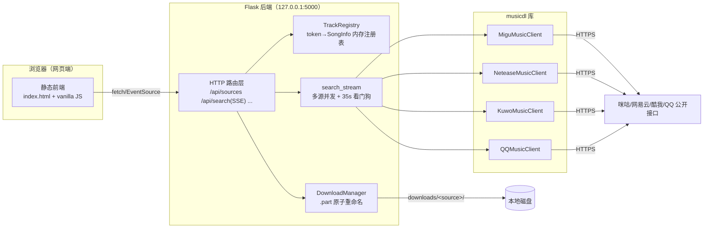
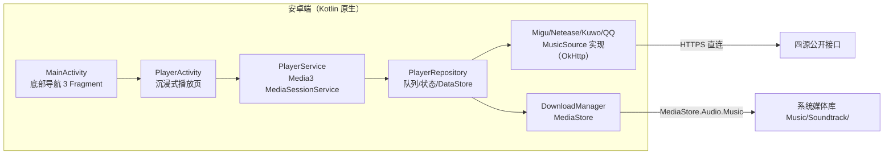
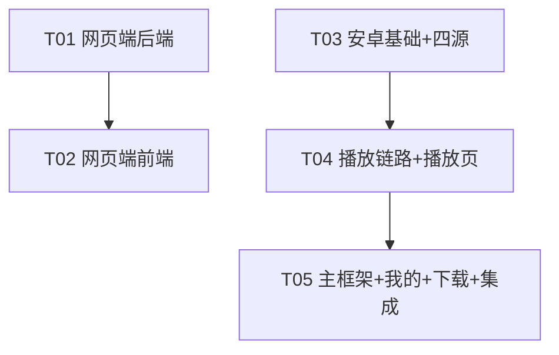

# 音符 Note — 系统设计与任务分解（ARCHITECTURE.md）

> 任务编号：software-musicdl-dual
> 作者：架构师 高见远（Bob）
> 输入：`PRD.md`（许清楚）、`.tmp/screenshot.png`、`.tmp/app.py`、`ref/{migu,netease,kuwo,qq}.py`
> 交付物：网页端（`web/`）+ 安卓端（`android/`），项目根 `C:\Users\jay\WorkBuddy\2026-09-09-11-22-17\`

---

# Part A · 系统设计

## 1. 总体架构





**设计要点（难点与对策）**

| 难点 | 对策 |
|---|---|
| musicdl 解析真实音频 URL 是逐曲网络往返，阻塞即"假死" | 照搬 `app.py`：直接驱动各 client 的 `_search`，watch 共享 bucket 列表增长，**每解析出一首立即经 SSE 推给前端**；每源 35s 看门狗线程，超时放弃不阻塞其他源 |
| 单源接口挂掉/变慢 | 源级隔离线程 + `source_error`/`source_done` 事件；前端对应 Tab 显示"无响应" |
| 浏览器拖动进度条 | 音频代理 `/api/stream/<token>` 透传 `Range` 头与 `206/Content-Range` |
| token 跨请求复用（避免重新搜索） | `TrackRegistry` 内存 token→SongInfo，随进程生命周期；重启后 404 → 前端提示"已过期" |
| 安卓离线构建（无 npm/无 Studio） | AGP 8.1.4 + Gradle 8.2 + 传统 View/XML + Material Components；依赖仅 OkHttp/Media3/Coroutines/Core-KTX/AppCompat/Material；仓库走腾讯镜像；**Gradle 用本地分发包 `build-tools/gradle-8.2/gradle.bat --no-daemon`，禁止 wrapper 联网下载** |
| 四源逻辑从 Python 移植到 Kotlin | `MusicSource` 接口统一抽象；每个源一个 Kotlin 类，逐行对照 `ref/*.py` 的 URL/Header/参数/解析路径；解析器链（多级 fallback）保留 |
| 酷我 `mobi.s` 加密参数 | musicdl 的 `kuwoutils.encryptquery` 是**标准 DES/ECB，key=`ylzsxkwm`（歌）/`yeelion`（词）**，Kotlin 用 `javax.crypto.Cipher("DES/ECB/PKCS5Padding")` 即可；歌词另有 zlib inflate + 异或还原，实现类 `KuwoCrypto`（对照 site-packages 源码逐函数移植） |

## 2. 技术选型表

| 层 | 选型 | 版本 | 理由 |
|---|---|---|---|
| Web 后端 | Python + Flask | 3.x + 3.0 | 环境已就绪；`app.py` 已验证可直接复用 |
| Web 搜索内核 | musicdl | 最新已装版 | 四源公开接口与解析逻辑现成 |
| Web 前端 | 原生 HTML/CSS/JS（ES Module） | — | **禁止 npm 构建**；由 Flask 同源静态服务 |
| Web 流式 | SSE（`text/event-stream`） | — | 单向推送足够，天然自动重连 |
| Android 语言/AGP | Kotlin / AGP | 1.9.24 / **8.1.4** | AGP 8.1.4 要求 Gradle ≥8.2，匹配现有本地分发包 `build-tools/gradle-8.2` |
| Android SDK | compileSdk/targetSdk 33, minSdk 24 | — | 离线仅 android-33 平台包（无 platform-34）；build-tools 34.0.0、platform-tools 35 已就位 |
| Android UI | View/XML + Material Components 1.11 | — | 避免 Compose 重型依赖，便于镜像离线构建 |
| 播放 | Media3 ExoPlayer + MediaSession | 1.3.1 | 官方推荐，通知栏/锁屏控制自带 |
| 网络 | OkHttp | 4.12.0 | 流式下载 + Range 支持 |
| 异步 | kotlinx-coroutines | 1.8.1 | 搜索/下载协程化 |
| 持久化 | SharedPreferences（轻量封装） | — | 比 DataStore 更少依赖；仅存历史/队列/设置 |
| 图片 | 自实现 MiniImageLoader（OkHttp + LruCache + 磁盘缓存） | — | 免 Glide，进一步减小依赖树 |
| Maven 仓库 | 腾讯镜像 `https://mirrors.cloud.tencent.com/nexus/repository/maven-public/`（google/mavenCentral 内容均有）+ `https://mirrors.cloud.tencent.com/gradle/` | — | 网络硬约束 |

## 3. 网页端设计

### 3.1 目录/文件清单（相对项目根）

```
web/
├── run.bat                      # 用指定解释器启动：python app.py
├── requirements.txt             # flask / requests / musicdl
├── app.py                       # Flask 入口 + 全部路由（结构对照 .tmp/app.py）
├── server/
│   ├── __init__.py
│   ├── config.py                # 端口/目录/源表/超时/MIME 常量
│   ├── registry.py              # TrackRegistry：token→SongInfo（线程安全）
│   ├── search.py                # search_stream / _drain / _safe_search / _NullProgress
│   ├── downloads.py             # DownloadManager：.part 流式落盘 + 进度表
│   └── proxy.py                 # Range 音频代理 + 封面代理
└── static/
    ├── index.html               # 单页骨架：顶栏/Tab/列表/底栏/歌词抽屉
    ├── css/style.css            # 暗色主题全部样式（见 3.4 设计规范）
    └── js/
        ├── main.js              # 入口：装配各模块、事件绑定、快捷键
        ├── store.js             # 全局状态 + 发布订阅（见 3.3）
        ├── api.js               # fetch 封装 + EventSource 封装
        ├── search.js            # 搜索发起/结果流式追加/源状态渲染
        ├── player.js            # <audio> 控制/进度/音量/连播/自动切歌
        ├── lyrics.js            # LRC 解析 + 同步滚动 + 点击跳转
        ├── queue.js             # 播放队列面板
        ├── wave.js              # 频谱可视化（AnalyserNode，降级静态占位）
        └── history.js           # 搜索历史（localStorage Top10）
```

### 3.2 Flask API 定义（与 `app.py` 行为一致）

| 路径 | 方法 | 请求 | 响应 |
|---|---|---|---|
| `/` | GET | — | `index.html` |
| `/static/<fname>` | GET | — | 静态文件 |
| `/api/sources` | GET | — | `[{id,label,short,default}]`，id 形如 `MiguMusicClient` |
| `/api/search` | GET | `?q=<关键词>&sources=MiguMusicClient,...` | **SSE**（事件见下） |
| `/api/stream/<token>` | GET | `Range` 头可选 | 音频字节流（透传 206/Content-Length/Content-Range，MIME 按 ext）；token 无效 → 404 |
| `/api/cover/<token>` | GET | — | 封面图片代理（缓存 max-age=86400） |
| `/api/lyric/<token>` | GET | — | `{lyric: "<LRC 原文>"}` |
| `/api/download` | POST | `{token}` | `{download_id}` |
| `/api/download/<id>/progress` | GET | — | **SSE**：`event: progress`，`{status:starting/downloading/done/error, downloaded,total,speed,name,path?,message?}` |
| `/api/file/<id>` | GET | — | 已完成文件，`Content-Disposition: attachment` |

**`/api/search` SSE 事件格式**（前端按事件类型分发）：

```
retry: 10000
event: source_start   data: {"source":"MiguMusicClient","label":"咪咕音乐"}
event: result         data: {"token":"<16hex>","source":"Migu","source_label":"咪咕音乐",
                             "song_name":"...","singers":"...","album":"...","ext":"mp3",
                             "file_size":"8.5MB","duration":"00:03:02","cover_url":"...",
                             "has_lyric":true,"lossless":false}
event: source_done    data: {"source":"...","count":8,"timed_out":false}
event: source_error   data: {"source":"...","message":"..."}
event: done           data: {"count":16}
```

### 3.3 前端模块与状态管理

无框架，采用**单一 Store + 发布订阅**：

```js
// store.js —— 全局唯一状态树 + observer 模式
state = {
  sources: [],            // /api/sources 结果
  activeSources: Set,     // 当前启用的源（默认仅咪咕）
  results: [],            // 流式追加的曲目（payload 同 SSE result）
  sourceStatus: {},       // source -> 'loading'|'done'|'error'|'timeout'
  queue: [],              // 播放队列 [{...track, token}]
  currentIndex: -1,
  isPlaying: false, currentTime: 0, duration: 0, volume: 0.8,
  lyricLines: [],         // [{timeMs, text}]
  activeLyricIndex: -1,
  lyricPanelOpen: false,
  history: [],            // localStorage
}
Store.get(key) / Store.set(key, value)  // set 触发订阅者
Store.on('results:append' | 'player:tick' | 'lyric:sync' | ..., fn)
```

- `search.js`：EventSource 订阅 `/api/search`，`result` → `results.push` + 列表局部 DOM 追加（不整表重绘）；`source_done/error` 更新 Tab 徽标。
- `player.js`：唯一 `<audio>` 实例，`src = /api/stream/<token>`；`ended` 自动 `next()`（跳过无 play_url 项并 Toast）；监听 `timeupdate` 广播 `player:tick`。
- `lyrics.js`：`[mm:ss.xx]` 正则解析；`player:tick` → 二分/线性查找 activeLyricIndex → transform 滚动。
- `wave.js`：WebAudio `AnalyserNode` 接 audio 元素；CORS 同源代理已满足；失败降级为 CSS 动画静态柱。
- 快捷键（W-09）：`keydown` 委托，空格/←→/↑↓。

### 3.4 设计规范（对照 screenshot.png 复刻）

| 项 | 规范 |
|---|---|
| 背景 | 页面 `#161616`；面板/抽屉 `#1E1E1E`；悬浮态 `#262626`；描边 `#2E2E2E` |
| 强调色 | **粉→橙渐变** `linear-gradient(90deg,#F5488B,#FF8A5C)`：进度条已播区、播放大按钮、当前行左描边、Logo 条；波形柱粉橙 |
| 文本 | 主 `#FFFFFF`、次 `#9A9A9A`、弱 `#5A5A5A` |
| 圆角 | 按钮/封面 8px；搜索框/胶囊 Tab 999px 全圆；卡片 12px |
| 毛玻璃 | 底栏与歌词抽屉：`background: rgba(22,22,22,.72); backdrop-filter: blur(20px);` |
| 字体层级 | 页面标题 18px/600；歌名 14px/500 #FFF；歌手/专辑 12px #9A9A9A；时长 12px 等宽 |
| 布局 | 顶栏 56px（左 Logo 5 彩条 + 「音符 / Soundtrack · powered by musicdl」，右圆角搜索框）；Tab 胶囊一行（选中：粉描边+文字提亮+微光晕）；结果表三列（曲目/专辑/时长），行高 64px，封面 48×48 圆角 8px；**当前播放行**左 4px 渐变描边 + 背景提亮 + "词"徽标；底栏 84px 三区（曲信息+词按钮 / 进度条+时间 / 播放大按钮 48px+上下曲+波形+音量）；歌词抽屉右侧 320px，当前行 opacity 1 + scale(1.05)，其余 .35 |

## 4. 安卓端设计

### 4.1 Gradle 工程结构（最小文件清单）

```
android/
├── settings.gradle.kts          # 插件/依赖仓库 = 腾讯 maven 镜像
├── build.gradle.kts             # 根：AGP 8.1.4 / Kotlin 1.9.24 插件声明（classpath 方式）
├── gradle.properties            # android.useAndroidX=true, jvmargs；android.sdk.dir=build-tools/android-sdk
├── gradle/wrapper/gradle-wrapper.properties   # 【可选】如用 wrapper 则 distributionUrl 指向本地 Gradle 8.2；主理人侧直接用 build-tools/gradle-8.2/gradle.bat --no-daemon 构建，wrapper 不联网下载
├── app/
│   ├── build.gradle.kts         # compileSdk 33 / minSdk 24 / targetSdk 33 / 依赖极简
│   ├── proguard-rules.pro       # minifyEnabled false（离线构建求稳）
│   └── src/main/
│       ├── AndroidManifest.xml  # INTERNET/FOREGROUND_SERVICE(+MEDIA_PLAYBACK)/POST_NOTIFICATIONS/WAKE_LOCK
│       ├── res/xml/network_security_config.xml  # 明文放行 migu/kuwo 相关 HTTP 域名
│       ├── res/xml/backup_rules.xml 等
│       ├── res/layout/  activity_main.xml, fragment_home.xml, fragment_search.xml,
│       │               fragment_mine.xml, item_song.xml, activity_player.xml, item_lyric_line.xml
│       ├── res/drawable|values/  底部导航图标、主题色（红橙渐变品牌色）、暗色主题
│       └── java/com/soundtrack/music/  （见 4.2）
```

**构建链实测环境（主理人离线组装，硬约束）**
- JDK17：`build-tools/jdk/jdk-17.0.20.1+1`
- Gradle：**8.2**，本地分发包 `build-tools/gradle-8.2`（构建用 `gradle.bat --no-daemon`，禁止 wrapper 联网）
- Android SDK：`build-tools/android-sdk`，目录已标准化 `platforms/android-33`、`build-tools/34.0.0`、`platform-tools 35`
- Maven 仓库（离线镜像）：`https://mirrors.cloud.tencent.com/nexus/repository/maven-public/`
- 注意：compileSdk/targetSdk 只能取 **33**（离线无 platform-34），依赖需与 API 33 兼容（Media3 1.3.1 minSdk 21 满足）

包名：`com.soundtrack.music`。

### 4.2 关键类与接口（Kotlin 签名）

```kotlin
// ── 数据模型（双端字段统一，见 §7 共享约定）─────────────────────
data class Song(
    val songId: String,      // 音源内唯一 id（identifier）
    val source: String,      // "migu" | "netease" | "kuwo" | "qq"
    val title: String,
    val artist: String,
    val album: String,
    val durationSec: Int,
    val coverUrl: String,
    var playUrl: String,     // resolve 后填充；空串=暂无音源
    var lrc: String,         // LRC 原文；空串=暂无歌词
    val ext: String,         // mp3/flac/...
    val fileSizeBytes: Long
)

// ── 音乐源抽象 ────────────────────────────────────────────────
interface MusicSource {
    val id: String                       // "migu"
    val label: String                    // "咪咕音乐"
    suspend fun search(keyword: String, pageSize: Int = 20): List<Song>
    suspend fun resolvePlayUrl(song: Song): String?   // 搜索时已解析则直接返回
    suspend fun fetchLyric(song: Song): String?
}

class SourceRegistry(val sources: List<MusicSource>) {
    fun byId(id: String): MusicSource?
    suspend fun searchAll(keyword: String, ids: List<String>,
        onEach: (Song) -> Unit, onSourceDone: (id: String, count: Int, timedOut: Boolean) -> Unit)
    // 四源 parallelScope 并发，逐条回调 onEach（对应网页端 SSE 的安卓版）
}

// ── 四源实现（逐行对照 ref/*.py）──────────────────────────────
class MiguMusicSource(ok: OkHttpClient) : MusicSource {
    // 搜索: GET https://c.musicapp.migu.cn/v1.0/content/search_all.do
    //       headers: ua=Android_migu, version=6.8.8, channel=014021I, Origin/Referer=h5.nf.migu.cn
    // 链接: GET /strategy/listen-url/h5/v2.4 (signature:1, birth:h5page)
    //       响应解密 _decryptresp：MAGIC=AB CD 01，seed=raw[3]，
    //       plain[i] = (raw[i+4] + seed - KEY[i%32]) & 0xFF，KEY="Jk8qzuePiJ1qE3mDYhLQ3T73DtDoAhLP"
    // 回退URL: https://app.pd.nf.migu.cn/MIGUM3.0/.../listenSong.do?...&toneFlag=<fmt>
    // 歌词: lyricUrl 或 app.c.nf.migu.cn/MIGUM3.0/strategy/pc/listen/v1.0 → data.lrcUrl
    private fun decryptResp(body: ByteArray): JSONObject
}
class NeteaseMusicSource(ok: OkHttpClient) : MusicSource {
    // 搜索: POST https://music.163.com/api/cloudsearch/pc  (form: s,type=1,offset,limit)
    //       headers: Referer=https://music.163.com/
    // 链接: 解析器链（对照 _parsewith*api 顺序）：haitangw → bugpk → ... 逐个 GET，
    //       取 data.url / url，校验 http 开头 & 非 outer/url 兜底
    // 歌词: 解析器返回中的 lyrics 字段
}
class KuwoMusicSource(ok: OkHttpClient) : MusicSource {
    // 搜索: GET http://www.kuwo.cn/search/searchMusicBykeyWord?...&all=<kw>&pn&rn=10
    //       → abslist[]，MUSICRID 去前缀 MUSIC_
    // 链接: GET http://mobi.kuwo.cn/mobi.s?f=kuwo&q=<DES加密query>
    //       query="user=0&corp=kuwo&source=kwplayer_ar_5.1.0.0_B_jiakong_vh.apk&p2p=1
    //              &type=convert_url2&sig=0&format=<flac|mp3>&rid=<id>"
    //       DES/ECB，key=ylzsxkwm（对照 musicdl kuwoutils.encryptquery），UA=okhttp/3.10.0
    //       响应体正则 http[^\s"]+ 提取
    // 歌词: http://newlyric.kuwo.cn/newlyric.lrc?<加密参数> → decodelyrics(DES key=yeelion)→zlib→clean
    // 元信息兜底: https://m.kuwo.cn/newh5/singles/songinfoandlrc?musicId=<id>
}
class QQMusicSource(ok: OkHttpClient) : MusicSource {
    // 搜索: POST https://u.y.qq.com/cgi-bin/musicu.fcg（对照 _constructsearchurls 的请求体）
    //       headers: Referer/Origin=y.qq.com
    // 封面: https://y.gtimg.cn/music/photo_new/T002R800x800M000<albumMid>.jpg
    // 链接: 解析器链（vkeys.cn → ...）：GET api.vkeys.cn/music/tencent/song/link?mid=&quality=
    // 歌词: GET c.y.qq.com/lyric/fcgi-bin/fcg_query_lyric_new.fcg (Referer=portal/player.html)
    //       → base64 解码 lyric 字段
}
// 通用：AudioLinkTester —— HEAD/Range 探测 URL 可用性、按 Content-Type 后缀判定 ext（对照 AudioLinkTester）

// ── 播放链路 ──────────────────────────────────────────────────
class PlayerRepository private constructor(ctx: Context) {   // 单例
    val player: ExoPlayer
    val queue: MutableList<Song>
    var currentIndex: Int
    fun play(list: List<Song>, startIndex: Int)   // resolvePlayUrl → setMediaItem → prepare/play
    fun playAt(index: Int); fun next(); fun prev(); fun toggle()
    fun addToQueue(song: Song); fun clearQueue()
    fun restoreFromPrefs(); fun persistToPrefs()  // 队列/索引持久化（SharedPreferences JSON）
}
class PlayerService : MediaSessionService {       // media3；onGetSession 返回 MediaSession(player)
    // 通知栏：MediaSession 自带 MediaStyle；setMediaMetadata(标题/歌手/封面) → 锁屏可见
}
class LrcParser {
    fun parse(raw: String): List<LyricLine>       // [mm:ss.xx] 多时间戳支持；无时间戳→纯文本行
    fun indexOf(timeMs: Long): Int                // 当前行索引
}
data class LyricLine(val timeMs: Long, val text: String)

// ── 下载与存储 ────────────────────────────────────────────────
class DownloadManager(ctx: Context, ok: OkHttpClient) {
    fun enqueue(song: Song, onProgress: (downloaded: Long, total: Long) -> Unit, onDone: (Uri?) -> Unit)
    // 流式写：API>=29 → MediaStore.Audio.Music，RELATIVE_PATH=Music/Soundtrack，
    //         IS_PENDING=1 → 写完置 0；API 24-28 → Environment.DIRECTORY_MUSIC/Soundtrack/
    // 文件名 "<title> - <artist>.<ext>"，非法字符替换 '_'；30s 无数据中止
}
class MiniImageLoader(ctx: Context) {             // OkHttp + LruCache(内存) + 磁盘缓存目录
    fun load(url: String, iv: ImageView, placeholderRes: Int)
}
class CrashGuard { static fun install(ctx) }      // Thread.uncaughtExceptionHandler → crash.log(本地)

// ── UI ────────────────────────────────────────────────────────
class MainActivity : AppCompatActivity()           // BottomNavigationView + 3 Fragment 切换
class HomeFragment                                  // Banner 占位 + 推荐歌单双列瀑布（RecyclerView GridLayoutManager）
class SearchFragment                                // 音源 Chips + 去抖搜索(400ms) + 结果 RecyclerView（流式追加）
class MineFragment                                  // 本地下载列表 / 播放历史 / 清缓存
class PlayerActivity                                // 沉浸式：封面高斯模糊背景(自实现 RenderScript 替代:缩放+抗锯齿+暗化叠层)、
                                                    // 旋转封面(ValueAnimator/属性动画)、进度条、控制行、歌词 Tab(长按复制)
```

### 4.3 播放服务 / 通知栏

- `PlayerService extends MediaSessionService`（media3 1.3.1）：`onGetSession()` 返回持有 ExoPlayer 的 `MediaSession`；Manifest 声明 `FOREGROUND_SERVICE`、`FOREGROUND_SERVICE_MEDIA_PLAYBACK`（API 34 必需）、`POST_NOTIFICATIONS`（运行时申请）。
- 通知由 Media3 自动构建（MediaStyle、上一首/播放暂停/下一首、锁屏与系统媒体控件可见），封面用 `MediaMetadata.artworkUri`（P1 可再设大图标 bitmap）。
- 队列超时/失败兜底：`Player.Listener.onPlayerError` → Toast + 自动 `next()`（对应 PRD 错误提示 3）。

### 4.4 LRC 解析与同步

- `LrcParser.parse`：正则 `\[(\d{1,2}):(\d{1,2})(?:[.:](\d{1,3}))?\]`，一行多时间戳展开；无任何时间戳 → 全部 timeMs=-1 的纯文本行。
- 同步：`ExoPlayer` 每帧（`Handler 100ms 轮询 currentPosition`）→ `indexOf(timeMs)` → RecyclerView `LinearLayoutManager.scrollToPositionWithOffset`，当前行白 18sp 加粗、上一行 14sp 半透明、其余 12sp 更暗。

### 4.5 下载与 MediaStore

- OkHttp `stream` 逐块写（64KB），`ContentResolver.insert(MediaStore.Audio.Music)` + `IS_PENDING`；完成后写 `MediaMetadataRetriever` 可读路径即系统可见。
- 通知：简单进度 Notification（P0 只 Toast+「我的」页进度条即可）。
- 文件名：`title - artist.ext`，`[\\/:*?"<>|]` → `_`，长度截断 120。

### 4.6 UI 结构（网易云/QQ 风格）

- `MainActivity`：`BottomNavigationView`（首页/搜索/我的，等宽 3 Tab，品牌红橙渐变选中态）+ Fragment 容器。
- **首页**：顶部 Banner（16dp 圆角，静态渐变占位）→「推荐歌单 / 每日更新」标题行 → 双列瀑布卡片（12dp 圆角封面 + 16sp 粗体标题 + 12sp 灰副标）。数据源：本期用「咪咕搜索热门关键词」拼装（如 华语/流行/经典 + 歌单名），无登录无云端歌单。
- **搜索页**：顶部水平 Chips（单选音源，选中实心品牌色，可多选展开）+ 24dp 圆角灰底搜索框（400ms 去抖）→ 结果列表 56dp 行高：48dp 圆角封面 / 歌名+歌手 / 最右音源小标签；流式追加（`SourceRegistry.searchAll` 的 onEach 回调直接 notifyItemInserted）。
- **播放页 `PlayerActivity`**：背景 = 封面缩放 8px 位图 + 放大模糊近似 + 70% 暗化叠层；中央 240dp 旋转封面（`ObjectAnimator` rotation，播放时长速旋转，暂停 `cancel`）；歌名 22sp 粗体白 + 歌手 14sp 灰白；细线进度条（品牌色圆点拇指）；控制行 ♡ / prev / 68dp 圆形播放 / next / ⤓ 下载；上滑或按钮切歌词区（当前行高亮、长按 `ClipboardManager` 复制）。
- **我的**：本地下载（时间倒序，查 MediaStore `Music/Soundtrack`）+ 播放历史 + 清缓存。

## 5. 关键时序（见 sequence-diagram.mermaid）

网页端搜索：`Store → api.searchEventSource('/api/search?q=..') → Flask /api/search → search_stream（4 源线程并发，各源内部多页 bucket 线程）→ 每解析一首 _drain → REGISTRY.add(token) → emit result → 前端 results.append + DOM 追加 → done`。

安卓播放：`SearchFragment → SourceRegistry.searchAll(onEach→adapter) → 点击 item → PlayerRepository.play(queue, idx) → MiguMusicSource.resolvePlayUrl → ExoPlayer.setMediaItem → PlayerService 前台通知 → onPositionDiscontinuity/轮询 → PlayerActivity 歌词同步`。

## 6. Anything UNCLEAR（已按默认假设决策，不阻塞）

| # | 不确定点 | 决策/假设 |
|---|---|---|
| U1 | 截图主色是粉红系，PRD 5.1 文案写"暖橙" | 按**截图**为准：粉→橙渐变（#F5488B→#FF8A5C），进度条已播区偏橙、描边偏粉，兼容两者描述 |
| U2 | 酷我官方 mobi.s DES 表是否与标准 DES 完全一致 | 假设 musicdl `kuwoutils` 为标准 DES/ECB 变体，Kotlin 侧先试 `javax.crypto`；实现时**逐行对照 site-packages 源码**，不一致则把常量表照抄进 `KuwoCrypto`；仍失败则降级第三方解析 API（与 ref 的解析器链策略一致） |
| U3 | 网易云/QQ 解析依赖第三方公益 API，稳定性未知 | 保留**多级解析器链**（照抄 ref 的 fallback 顺序），全挂时该源报 `source_error`，不影响其他源 |
| U4 | 安卓首页"推荐歌单"无现成歌单接口 | 用四源热门关键词搜索结果拼装伪歌单（每卡片=一次预置关键词搜索），点击卡片进歌单详情（=搜索结果列表） |
| U5 | 封面模糊背景 RenderScript 在新 AGP 被移除 | 自实现：封面缩至 ~20px 再拉伸 + 暗化叠层，视觉近似高斯模糊，零依赖 |
| U6 | minSdk 24 下 Media3 最低要求 | Media3 1.3.1 minSdk 21，满足；通知运行时权限仅 API 33+ 申请 |
| U7 | 网页端 Waveform 用 WebAudio 需 audio 元素未被 CORS 污染 | 代理同源，天然满足；失败降级静态动画 |
| U8 | Gradle wrapper 二进制是否已分发 | 实测已组装 **Gradle 8.2** 本地分发包 `build-tools/gradle-8.2`；构建直接用 `gradle.bat --no-daemon`，wrapper 不联网下载。`gradle-wrapper.properties` 如需保留则指向本地 8.2 分发包 |

---

# Part B · 任务分解

## 7. 依赖清单

**网页端（Python，环境已就绪，仅声明）**
```
flask>=3.0
requests>=2.31
musicdl>=2.x        # 已安装
```

**安卓端（app/build.gradle.kts，全部走腾讯镜像）**
```
androidx.core:core-ktx:1.13.1
androidx.appcompat:appcompat:1.7.0
com.google.android.material:material:1.11.0
androidx.constraintlayout:constraintlayout:2.1.4
androidx.recyclerview:recyclerview:1.3.2
androidx.media3:media3-exoplayer:1.3.1
androidx.media3:media3-session:1.3.1
com.squareup.okhttp3:okhttp:4.12.0
org.jetbrains.kotlinx:kotlinx-coroutines-android:1.8.1
```

## 8. 共享约定

1. **歌曲数据模型字段统一**（网页端 JSON ↔ 安卓端 `Song`）：
   `song_id / source / title / artist / album / duration(秒) / cover_url / play_url / lrc(+ext, file_size)`。
   网页端 SSE `result` 额外带 `token`（token 机制仅网页端有，安卓端直接持有 playUrl）。
2. **source 取值**：`migu | netease | kuwo | qq`（网页端 short 名一致）；内部类名 `XxxMusicClient`(Py) / `XxxMusicSource`(Kt)。
3. **错误码/错误约定**：HTTP 404=token 过期或资源不存在；502=上游错误；400=参数缺失；SSE `source_error` 事件携带 `{source, message}`；"无可用音源"一律文案「该平台暂不可用」。
4. **命名**：Python snake_case；Kotlin camelCase，类名 PascalCase；资源名 `snake_case.xml`；包名 `com.soundtrack.music`。
5. **文件名规则**（下载统一）：`<title> - <artist>.<ext>`，非法字符→`_`，≤120 字符。
6. **时间**：duration 统一**秒（Int）**；展示层自行格式化 `mm:ss`。
7. **超时统一**：搜索 35s/源；音频代理连接 10s 读 30s；下载 30s 无数据中止。
8. **免责声明**：两端「关于」处展示 PRD §8 文案。

## 9. 任务列表（有序，≤5 个，工程师可按序直接执行）

| ID | 任务 | 涉及文件 | 依赖 | 优先级 |
|---|---|---|---|---|
| **T01** | **网页端后端**：从 `.tmp/app.py` 落地工程化后端（拆分 config/registry/search/downloads/proxy 模块，行为与 app.py 完全一致），静态目录与启动脚本 | `web/app.py`、`web/server/{__init__,config,registry,search,downloads,proxy}.py`、`web/run.bat`、`web/requirements.txt` | 无 | P0 |
| **T02** | **网页端前端**：暗色「音符」UI 复刻截图（顶栏/胶囊 Tab/结果表/渐变当前行/毛玻璃底栏/波形/歌词抽屉）+ SSE 流式渲染 + 播放器/队列/歌词同步/下载进度/快捷键/搜索历史 | `web/static/index.html`、`web/static/css/style.css`、`web/static/js/{main,store,api,search,player,lyrics,queue,wave,history}.js` | T01（API 契约） | P0 |
| **T03** | **安卓基础设施 + 四源客户端**：Gradle 工程（腾讯镜像/AGP8.1.4/SDK33/min24）、Manifest、主题与网络配置；`Song`/`MusicSource`/`SourceRegistry`/`AudioLinkTester`/`OkHttp` 单例；`Migu/Netease/Kuwo/QQ` 四源 Kotlin 移植（含 `KuwoCrypto`、咪咕解密、解析器链）；`MiniImageLoader`、`CrashGuard` | `android/settings.gradle.kts`、`android/build.gradle.kts`、`android/gradle.properties`、`android/gradle/wrapper/*`、`app/build.gradle.kts`、`proguard-rules.pro`、`AndroidManifest.xml`、`res/xml/network_security_config.xml`、`res/values/{colors,themes,strings}.xml`、`java/.../model/Song.kt`、`source/{MusicSource,SourceRegistry,AudioLinkTester,MiguMusicSource,NeteaseMusicSource,KuwoMusicSource,QQMusicSource,KuwoCrypto}.kt`、`util/{Net.kt,MiniImageLoader.kt,CrashGuard.kt,Formatters.kt}` | 无（与 T01/T02 并行） | P0 |
| **T04** | **安卓播放链路 + 播放页**：`PlayerRepository`（队列/连播/失败跳下首/持久化）、`PlayerService`（MediaSessionService+通知+锁屏）、`LrcParser`；沉浸式 `PlayerActivity`（模糊背景/旋转封面/进度/控制行/歌词同步长按复制）；`SearchFragment`（Chips+去抖+流式结果） | `player/{PlayerRepository,PlayerService,LrcParser}.kt`、`ui/PlayerActivity.kt`、`ui/SearchFragment.kt`、`res/layout/{activity_player,item_song,item_lyric_line}.xml`、`res/layout/fragment_search.xml`、`res/drawable/*` | T03 | P0 |
| **T05** | **安卓主框架 + 我的 + 下载 + 集成**：`MainActivity`+底部导航+`HomeFragment`（Banner+伪歌单瀑布）、`MineFragment`（下载列表/历史/清缓存）、`DownloadManager`（MediaStore/Soundtrack/流式+超时）、`PrefsStore`（历史/队列）、首选项主题色；双端联调自测 | `ui/{MainActivity,HomeFragment,MineFragment,SongAdapter,PlaylistAdapter}.kt`、`download/DownloadManager.kt`、`data/PrefsStore.kt`、`res/layout/{activity_main,fragment_home,fragment_mine}.xml`、`res/menu/bottom_nav.xml`、`res/navigation（可选）` | T04 | P1 |

实现顺序：`T01 → T02`（网页端先行可独立验收）；`T03 → T04 → T05`（安卓端）；T01/T03 可并行。

## 10. 任务依赖图



## 11. 验收要点（供 QA 参考）

- 网页：搜索"周杰伦"（咪咕默认开）首条 ≤3s 出现；播放可拖动；歌词随播滚动；下载完成后 `downloads/Migu/歌名 - 歌手.mp3` 存在；开启 QQ/网易源后某源挂掉不影响其他源出结果。
- 安卓：`gradlew assembleDebug` 离线镜像构建成功；三 Tab 可切换；搜索结果点击即播且通知栏出现；播放页旋转封面/歌词同步；下载后系统音乐 App 可见 `Music/Soundtrack/` 文件。
